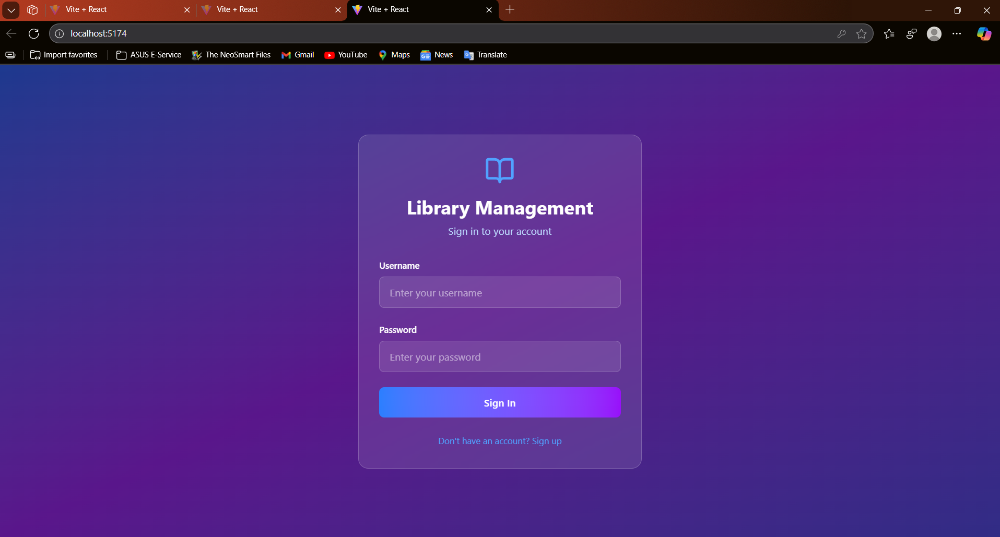
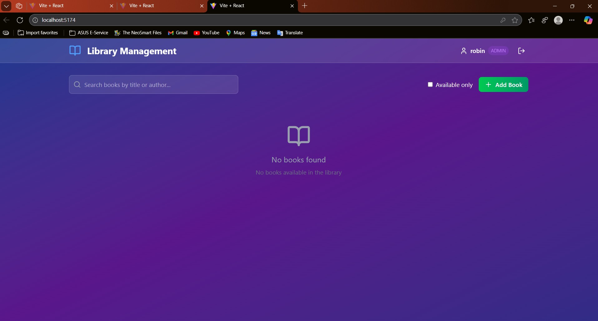

# Library Management System

A full-stack web application for managing library books with user authentication, book borrowing/returning functionality, and admin controls.

## 🚀 Features

- **User Authentication** - Register/Login with JWT tokens
- **Role-based Access Control** - Admin and Member roles
- **Book Management** - Add, edit, delete books (Admin only)
- **Book Operations** - Borrow and return books
- **Search & Filter** - Search books by title/author
- **Responsive Design** - Works on desktop and mobile
- **REST API** - Complete RESTful backend with documentation

## 🛠️ Tech Stack

### Backend
- **Java 17**
- **Spring Boot 3.2**
- **Spring Security** with JWT
- **Spring Data JPA**
- **Postgres Database**

### Frontend
- **React 18**
- **Tailwind CSS**
- **Lucide React** (icons)
- **Context API** for state management

## 📋 Prerequisites

- Java 17 or higher
- Node.js 16+ and npm
- Postgres
- Maven 3.6+

## ⚡ Quick Start

### Backend Setup

1. **Clone the repository**
   ```bash
   git clone <your-repo-url>
   cd library-management-system
   ```

2. **Create Postgres database**
   ```sql
   CREATE DATABASE librarymanagement;
   ```

3. **Update database configuration**
   Edit `src/main/resources/application.properties`:
   ```properties
   spring.datasource.username=your_username
   spring.datasource.password=your_password
   ```

4. **Run the backend**
   ```bash
   mvn spring-boot:run
   ```

### Frontend Setup

1. **Navigate to frontend directory**
   ```bash
   cd frontend
   ```

2. **Install dependencies**
   ```bash
   npm install
   ```

3. **Start the development server**
   ```bash
   npm start
   ```

4. **Access the application**
   Open: http://localhost:3000

## 🎯 API Endpoints

### Authentication
| Method | Endpoint | Description |
|--------|----------|-------------|
| POST | `/api/auth/register` | Register new user |
| POST | `/api/auth/login` | User login |

### Books
| Method | Endpoint | Description | Auth Required |
|--------|----------|-------------|---------------|
| GET | `/api/books` | Get all books | No |
| GET | `/api/books/available` | Get available books | No |
| GET | `/api/books/search?keyword=` | Search books | No |
| POST | `/api/books` | Add new book | Admin |
| PUT | `/api/books/{id}` | Update book | Admin |
| DELETE | `/api/books/{id}` | Delete book | Admin |
| POST | `/api/books/{id}/borrow` | Borrow book | Yes |
| POST | `/api/books/{id}/return` | Return book | Yes |

## Frontend overview :-
- Login


- Dashboard : -


- Project details : -


- Available books : -


## 📝 Usage Examples

### Register a User
```bash
POST /api/auth/register
Content-Type: application/json

{
  "username": "john_doe",
  "email": "john@example.com",
  "password": "password123",
  "role": "MEMBER"
}
```

### Login
```bash
POST /api/auth/login
Content-Type: application/json

{
  "username": "john_doe",
  "password": "password123"
}
```

### Add a Book (Admin only)
```bash
POST /api/books
Authorization: Bearer <your-jwt-token>
Content-Type: application/json

{
  "title": "The Great Gatsby",
  "author": "F. Scott Fitzgerald",
  "isbn": "978-0-7432-7356-5"
}
```

### Borrow a Book
```bash
POST /api/books/1/borrow
Authorization: Bearer <your-jwt-token>
```

## 🔧 Configuration

### Database Configuration
Update `application.properties` with your database details:
```properties
spring.datasource.url=jdbc:mysql://localhost:3306/library_db
spring.datasource.username=your_username
spring.datasource.password=your_password
```

### JWT Configuration
The JWT secret key is configured for security. Modify if needed:
```properties
app.jwt.secret=your-secure-secret-key-here
app.jwt.expiration=86400000
```

## 👥 User Roles

### Member
- View all books
- Search books
- Borrow available books
- Return borrowed books

### Admin
- All member permissions
- Add new books
- Edit existing books
- Delete books (only if not borrowed)

## 📱 Frontend Features

- **Modern UI** with glassmorphism design
- **Responsive** layout for all devices
- **Real-time search** and filtering
- **Toast notifications** for user actions
- **Loading states** and error handling
- **Protected routes** based on authentication

## 🗄️ Database Schema

### Users Table
- id (Primary Key)
- username (Unique)
- email (Unique) 
- password (Encrypted)
- role (ADMIN/MEMBER)
- created_at

### Books Table
- id (Primary Key)
- title
- author
- isbn (Unique)
- available (Boolean)
- created_at

### Borrow Records Table
- id (Primary Key)
- user_id (Foreign Key)
- book_id (Foreign Key)
- borrowed_at
- returned_at

## 🚦 Development

### Running Tests
```bash
# Backend tests
mvn test

# Frontend tests
npm test
```

### Building for Production
```bash
# Backend
mvn clean package

# Frontend
npm run build
```

## 🔍 API Documentation

Complete API documentation is available at:
- Swagger UI: http://localhost:8080/swagger-ui.html
- OpenAPI JSON: http://localhost:8080/api-docs

## 🤝 Contributing

1. Fork the repository
2. Create a feature branch
3. Make your changes
4. Add tests if applicable
5. Submit a pull request


## 🆘 Troubleshooting

### Common Issues

**Database Connection Error**
- Ensure Postgres is running
- Check database credentials in `application.properties`
- Verify database `library_db` exists

**JWT Token Error**
- Ensure the JWT secret is at least 32 characters long
- Check token format in Authorization header: `Bearer <token>`

**CORS Issues**
- Backend CORS is configured for `*` origins
- For production, update CORS configuration in `CorsConfig.java`

**Port Already in Use**
- Backend: Change `server.port` in `application.properties`
- Frontend: Set `PORT=3001 npm start`

## 📞 Support

For support and questions:
- Create an issue in the repository
- Check the API documentation
- Review the troubleshooting section

---

**Built with ❤️ using Spring Boot and React**
